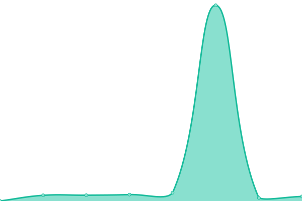

# [📈 Live Status](https://status.savew.dev): <!--live status--> **🟧 Partial outage**

This repository contains the open-source uptime monitor and status page for [Yağız](https://savew.dev/), powered by [Upptime](https://github.com/upptime/upptime).

With [Upptime](https://upptime.js.org), you can get your own unlimited and free uptime monitor and status page, powered entirely by a GitHub repository. We use [Issues](https://github.com/saveside/status.savew.dev/issues) as incident reports, [Actions](https://github.com/saveside/status.savew.dev/actions) as uptime monitors, and [Pages](https://status.savew.dev) for the status page.

<!--start: status pages-->
<!-- This summary is generated by Upptime (https://github.com/upptime/upptime) -->
<!-- Do not edit this manually, your changes will be overwritten -->
<!-- prettier-ignore -->
| URL | Status | History | Response Time | Uptime |
| --- | ------ | ------- | ------------- | ------ |
|  [honeypie](https://honeypie.savew.dev) | 🟩 Up | [honeypie.yml](https://github.com/saveside/status.savew.dev/commits/HEAD/history/honeypie.yml) | 

 455ms
     
 | 

<a href="https://status.savew.dev/history/honeypie">99.79%</a>
    

|  [honeybee](https://honeybee.savew.dev) | 🟩 Up | [honeybee.yml](https://github.com/saveside/status.savew.dev/commits/HEAD/history/honeybee.yml) | 

 484ms
     
 | 

<a href="https://status.savew.dev/history/honeybee">99.79%</a>
    

|  [argo](https://argo.savew.dev) | 🟥 Down | [argo.yml](https://github.com/saveside/status.savew.dev/commits/HEAD/history/argo.yml) | 

 581ms
     
 | 

<a href="https://status.savew.dev/history/argo">99.79%</a>
    

|  [ai](https://chat.savew.dev) | 🟥 Down | [ai.yml](https://github.com/saveside/status.savew.dev/commits/HEAD/history/ai.yml) | 

 668ms
     
 | 

<a href="https://status.savew.dev/history/ai">91.96%</a>
    

|  [main](https://savew.dev) | 🟩 Up | [main.yml](https://github.com/saveside/status.savew.dev/commits/HEAD/history/main.yml) | 

 178ms
     
 | 

<a href="https://status.savew.dev/history/main">100.00%</a>
    

|  [notes](https://notes.savew.dev) | 🟩 Up | [notes.yml](https://github.com/saveside/status.savew.dev/commits/HEAD/history/notes.yml) | 

 230ms
     
 | 

<a href="https://status.savew.dev/history/notes">100.00%</a>
    

|  [helm](https://helm.savew.dev) | 🟩 Up | [helm.yml](https://github.com/saveside/status.savew.dev/commits/HEAD/history/helm.yml) | 

 180ms
     
 | 

<a href="https://status.savew.dev/history/helm">100.00%</a>
    

|  [vault](https://vault.savew.dev) | 🟩 Up | [vault.yml](https://github.com/saveside/status.savew.dev/commits/HEAD/history/vault.yml) | 

 488ms
     
 | 

<a href="https://status.savew.dev/history/vault">91.96%</a>
    

<!--end: status pages-->

[**Visit our status website →**](https://status.savew.dev)undefined
